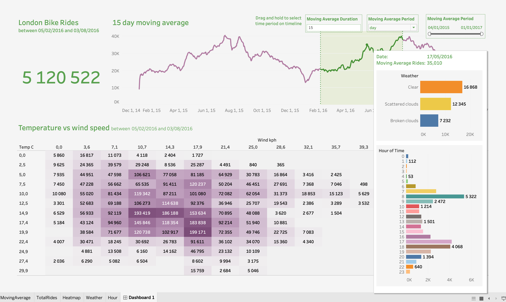

# 🚲 London Bike Sharing Analysis

## 📌 Project Overview
This project analyzes bike-sharing trends in London using the **London Bike Sharing Dataset** from Kaggle. The goal is to explore patterns in bike rentals based on various factors such as time of day, weather conditions, and seasonal variations. The analysis is supported by data visualization and an interactive dashboard.

🔗 **Dataset**: [London Bike Sharing Dataset on Kaggle](https://www.kaggle.com/datasets/hmavrodiev/london-bike-sharing-dataset)

---

## 📈 Key Insights
- **Seasonal Trends**: Bike rentals are higher during warmer months and drop during winter.
- **Weather Impact**: Rain and low temperatures negatively affect the number of rentals.
- **Peak Hours**: Most rides occur during morning and evening rush hours, indicating a strong commuter usage pattern.
- **Working vs. Non-Working Days**: Significant differences in rental numbers between weekdays and weekends.

---

## 🖥️ Dashboard
To view the **interactive dashboard**, check out the following options:
- **Tableau Public Link**: [Add your Tableau Public link here]
- If using a local Tableau file, download the `.twbx` file and open it in **Tableau Desktop**.

📷 **Dashboard Preview:**


---

## 📊 Tools & Technologies
- **Tableau** (for data visualization and dashboard creation)
- **Python & Jupyter Notebook** (for data cleaning and exploratory analysis)
- **GitHub** (for version control and portfolio hosting)

---

## 🚀 How to Use This Repository
1. Clone this repository:
   ```bash
   git clone https://github.com/RicardoJCSousa/london-bike-sharing.git
   ```
2. Navigate to the project folder and explore the Jupyter notebooks.
3. Open the **Tableau dashboard** to interact with the visual insights.

---

## 📌 Future Improvements
- Incorporate **machine learning** to predict bike demand.
- Add **real-time weather API** for dynamic insights.
- Enhance **dashboard interactivity** with more filters and charts.

---

## 📝 Contact
If you have any questions or feedback, feel free to reach out!
📧 Email: [ricardo.correia.sousa@gmail.com]  
🔗 LinkedIn: [www.linkedin.com/in/ricardocsousa]  
📂 GitHub: [https://github.com/RicardoJCSousa]
